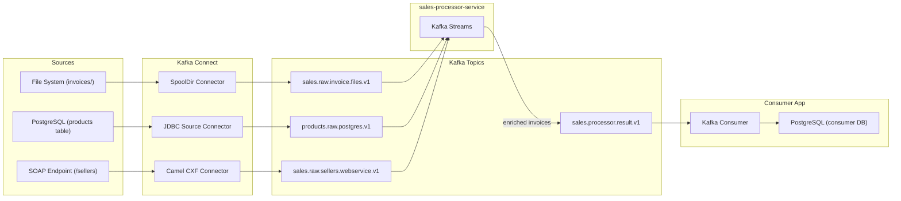

# data-processing

Kafka Connect pipeline that watches directories for files and publishes events to Kafka topics.
Also includes a JDBC Source connector that reads products from PostgreSQL.

## Structure

```
data-processing/
  connect/                        # Kafka Connect Docker image (SpoolDir plugin)
  connectors/
    file-processor/
      backup-data-invoices/       # Default .json invoice files for testing
      invoices/                   # Drop .json invoice files here
      processed/                  # Files moved here after successful processing
      error/                      # Files moved here on failure
      invoices-file-connector.json
    postgres-products/
      products-jdbc-connector.json
    webservice-processor/
      wsdl/SalesService.wsdl      # WSDL for the sellers SOAP endpoint
      sellers-webservice-connector.json
      run.sh                      # Script to send seller requests and verify
  db/
    init/                         # Postgres init SQL (products table + sample data)
  docker-compose.yml
```

## Requirements

- [Docker](https://www.docker.com/) with Compose

## Start

**Linux / macOS:**

```bash
docker compose up --build
```

## Stop

Stops all containers and **removes volumes** (full clean reset — all Kafka data wiped):

```bash
docker compose down -v
```

To stop without losing data (keeps volumes):

```bash
docker compose down
```

## File connector
### For processing new invoices, you can follow the below steps:

1. Drop a `.json` file into `connectors/file-processor/invoices/`
2. SpoolDir detects it and publishes the content as an event to `sales.raw.invoice.files.v1`
3. The file is moved to `processed/` on success or `error/` on failure

## Filesystem invoices connector

- SpoolDir watches `connectors/file-processor/invoices/` for `.json` files.
- Each file is parsed and published as an event to `sales.raw.invoice.files.v1`.
- Processed files move to `processed/`; failures move to `error/`.

## Sellers webservice connector

- A SOAP endpoint listens on port `8181` at `/sellers`.
- Receives seller data (saleId, sellerName, city, country, totalAmount, currency, saleDate) via SOAP/XML.
- Publishes raw messages to `sales.raw.sellers.webservice.v1` using Apache Camel CXF.

## PostgreSQL products connector
### For processing new products, you can follow the below steps:

- Connect to productsdb Postgres DB started on port `5433` (container `5432`).
- Insert the new product you want to add.
- The JDBC Source connector reads the `products` table and publishes to `products.raw.postgres.v1`.

### What it does

Reads hardware products (e.g., CPUs, RAM, GPUs) from PostgreSQL and publishes them to Kafka so other services can consume a live stream of catalog changes.

## Sales Processor Service

`sales-processor-service` is a Kafka Streams application that reads invoice events, enriches invoice items with product data, and publishes processed results.

### Topics

- Input invoices: `sales.raw.invoice.files.v1`
- Input products: `products.raw.postgres.v1`
- Output: `sales.processor.result.v1`

### Enrichment behavior

- Each invoice item uses `itemId` as SKU.
- The service keeps a materialized Kafka Streams state store keyed by SKU from the products topic.
- During invoice processing, each item is enriched with:
  - `product_name`
  - `product_category`
  - `product_lookup_status` (`FOUND` or `NOT_FOUND`)

### Runtime notes

- New products inserted in PostgreSQL are published by the JDBC connector and become available for enrichment shortly after (based on connector poll interval).
- On service restart, Kafka Streams restores the local state store from changelog/offsets, so processing continues from the last committed state.

### Flow (macro)

We have **three sources** (FS, DB, WS) feeding Kafka topics via **Kafka Connect**. A **Kafka Streams** application enriches and joins the data, then publishes results to an output topic consumed by the **Consumer App**.

1. **FS source** → SpoolDir connector publishes invoice JSON files to `sales.raw.invoice.files.v1`.
2. **DB source** → JDBC Source connector publishes product rows to `products.raw.postgres.v1`.
3. **WS source** → Camel CXF connector publishes seller SOAP messages to `sales.raw.sellers.webservice.v1`.
4. **Kafka Streams** (`sales-processor-service`) consumes invoices and sellers, enriches invoice items with product data from a materialized state store (fed by `products.raw.postgres.v1`), and produces to `sales.processor.result.v1`.
5. **Consumer App** reads `sales.processor.result.v1` and persists enriched results to its own PostgreSQL database.

### Diagram



## Service URLs

| Service           | URL                    | Credentials       |
| ----------------- | ---------------------- | ----------------- |
| **Kafka UI**      | http://localhost:8080  | —                 |
| **Grafana**       | http://localhost:3000  | `admin` / `admin` |
| **Prometheus**    | http://localhost:9090  | —                 |
| **Loki**          | http://localhost:3100  | — (API only)      |
| **Alloy**         | http://localhost:12345 | —                 |
| **Kafka Connect** | http://localhost:8083  | — (REST API)      |

## Kafka UI

Open [http://localhost:8080](http://localhost:8080) in your browser after starting the stack.
**Linux / macOS:**

```bash
curl http://localhost:8083/connectors/invoices-file-source/status | jq
```

## Check connector status

**Linux / macOS / Windows:**

```bash
docker exec -it data-processing-kafka-1t:8083/connectors/invoices-file-source/status
```

## Consume events (optional)

```bash
docker exec -it <kafka-container> kafka-console-consumer \
  --bootstrap-server localhost:9092 \
  --topic sales.raw.invoice.files.v1 \
  --from-beginning
```

## Consumer Application

The Consumer is a Springboot application that consumes enriched sales data from kafta and exposes it via REST API endpoints.

### What it does

- **Comsumes** from `sales.processor.result.v1` topic (enriched invoices from Kafka Streams)
- **Persists** sales data on the Postgres database
- **Exposes** REST API endpoints for querying sales data
- **Tracks** data lineage using OpenLineage for observability

### How to run

From the `consumer/` directory:

```bash
docker compose up --build
```

The consumer will:
- Start PostgreSQL on port 5434
- Start the Springboot app on port 8082
- Connect to the Kafka cluster from the main docker-compose stack
- Begin consuming from sales.processor.result.v1 automatically.

To stop:


docker compose down -v  # removes values
docker compose down     # keep the data

Endpoints

Base URL: http://localhost:8082


| Endpoint                          | Method                | Description                               |
|-----------------------------------|-----------------------|-------------------------------------------|
| **/results**                      | GET                   | Return all consumed sales record          |
| **/results/top-salesman-country** | GET                   | Returns top salesmen aggregated by country|
| **/results/top-sales-per-city**   | GET                   | Returns total sales aggregated by city    |


