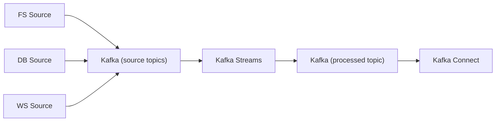

# data-processing

Kafka Connect pipeline that watches directories for files and publishes events to Kafka topics.
Also includes a JDBC Source connector that reads products from PostgreSQL.

## Structure

```
data-processing/
  connect/                        # Kafka Connect Docker image (SpoolDir plugin)
  connectors/
    file-processor/
      backup-data-invoices/       # Default .json invoice files for testing
      invoices/                   # Drop .json invoice files here
      processed/                  # Files moved here after successful processing
      error/                      # Files moved here on failure
      invoices-file-connector.json
    postgres-products/
      products-jdbc-connector.json
  db/
    init/                         # Postgres init SQL (products table + sample data)
  docker-compose.yml
```

## Requirements

- [Docker](https://www.docker.com/) with Compose

## Start

**Linux / macOS:**

```bash
docker compose up --build
```

**Windows (PowerShell):**

```powershell
docker compose up --build
```

## Stop

Stops all containers and **removes volumes** (full clean reset — all Kafka data wiped):

```bash
docker compose down -v
```

To stop without losing data (keeps volumes):

```bash
docker compose down
```

## How it works

1. Drop a `.json` file into `connectors/file-processor/invoices/`
2. SpoolDir detects it and publishes the content as an event to `sales.raw.invoice.files.v1`
3. The file is moved to `processed/` on success or `error/` on failure

## PostgreSQL products connector

- A local Postgres is started on port `5433` (container `5432`).
- The JDBC Source connector reads the `products` table and publishes to `products.raw.postgres.v1`.

### What it does

Reads hardware products (e.g., CPUs, RAM, GPUs) from PostgreSQL and publishes them to Kafka so other services can consume a live stream of catalog changes.

### Flow (macro)

We have **three sources** (FS, DB, WS). All of them feed a **Kafka Streams** application.
After processing, Kafka Connect publishes the results through **our connector**.

1. **FS source**: file connector publishes raw events to Kafka.
2. **DB source**: JDBC Source connector publishes product rows to Kafka.
3. **WS source**: (future) WebSocket/source service publishes to Kafka.
4. **Kafka Streams** consumes these source topics and produces a processed topic.
5. **Kafka Connect** reads the processed topic and delivers it via **our connector** (sink).

### Diagram



## Service URLs

| Service           | URL                    | Credentials       |
| ----------------- | ---------------------- | ----------------- |
| **Kafka UI**      | http://localhost:8080  | —                 |
| **Grafana**       | http://localhost:3000  | `admin` / `admin` |
| **Prometheus**    | http://localhost:9090  | —                 |
| **Loki**          | http://localhost:3100  | — (API only)      |
| **Alloy**         | http://localhost:12345 | —                 |
| **Kafka Connect** | http://localhost:8083  | — (REST API)      |

## Kafka UI

Open [http://localhost:8080](http://localhost:8080) in your browser after starting the stack.
**Linux / macOS:**

```bash
curl http://localhost:8083/connectors/invoices-file-source/status | jq
```

## Check connector status

**Linux / macOS / Windows:**

```bash
docker exec -it data-processing-kafka-1t:8083/connectors/invoices-file-source/status
```

## Consume events (optional)

```bash
docker exec -it <kafka-container> kafka-console-consumer \
  --bootstrap-server localhost:9092 \
  --topic sales.raw.invoice.files.v1 \
  --from-beginning
```
